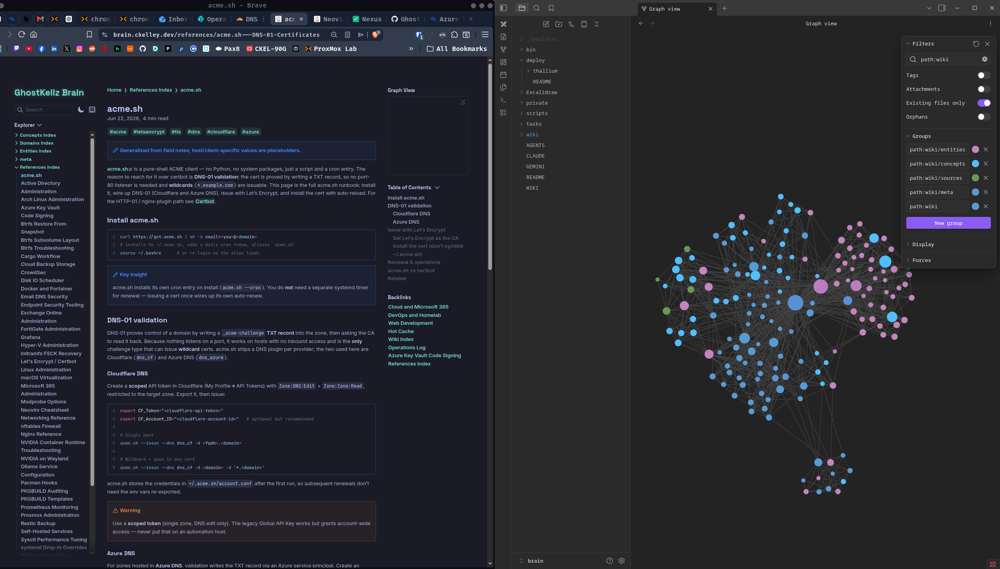

# 👻 GhostKellz Brain

<p align="center">
  <strong>An AI-queryable, cross-referenced second brain — markdown in git, readable by humans and by Claude / Codex.</strong>
</p>

<p align="center">
  <em>Knowledge & AI stack</em><br>
  
  
  
  
  
  
</p>

<p align="center">
  <em>Infrastructure</em><br>
  
  
  
  
  
</p>

<p align="center">
  <em>Project</em><br>
  <a href="https://brain.ckelley.dev"></a>
  
  
  
  
</p>

<p align="center">
  <a href="https://brain.ckelley.dev">
    
  </a>
  <br>
  <em>One vault, two views — the published <a href="https://brain.ckelley.dev">Quartz site</a> (left) and the Obsidian graph (right).</em>
</p>

---

> 🧠 **About this repository:**
> A public, cross-referenced knowledge layer over my systems, dev ecosystem, MSP
> operations, and cross-platform notes (Linux / macOS / Windows). It mirrors the
> [`arch`](https://github.com/ghostkellz/arch) pattern — a markdown knowledge base
> owned outright, queryable by [Claude](https://claude.com/claude-code) and Codex
> through a filesystem MCP, with retrieval embeddings generated locally.

> 📓 **Note:** Treat this as a living **knowledge base**, not authoritative docs.
> Details (versions, commands, topology labels) reflect a point in time and drift.

---

## ⚠️ This repo is PUBLIC

Only public-safe knowledge is *committed* here. The vault on disk may also hold
private notes, but they live in gitignored paths and never leave the machine. The
tiering is strict and load-bearing — because the public tier is meant to ship as a
website, anything committed here is effectively published.

| Tier | What | Lives in |
|------|------|----------|
| 🟢 **Public** (tracked) | general cheatsheets, cross-platform notes, OSS project docs | GitHub `ghostkellz/brain` |
| 🟡 **Personal / home-lab / security** | heimdall-stack, security configs, infra inventory | gitignored `private/` paths in this vault — local-only, never pushed |
| 🔴 **Client-confidential** | per-client runbooks, topologies, M365 tenants | **Hudu** (`hudu.cktechx.com`) — system of record, never in git |

Never commit home-lab topology, security configs, secrets, or client data here.
When in doubt, it goes in a gitignored `private/` path or Hudu — not the tracked
public tier.

---

## 📊 What's inside

8 domains · ~150 cross-linked pages.

| Type | Count | What |
|------|-------|------|
| 🏛️ **Domains** | 8 | top-level topic hubs |
| 🔖 **Entities** | 52 | people, orgs, products, repos, tools |
| 💡 **Concepts** | 39 | ideas, patterns, frameworks |
| 📒 **References** | 39 | runbooks and how-tos |
| 📥 **Sources** | 3 | one summary per raw source |

**Domains:** Linux & Systems · AI & Local LLMs · Networking · Cloud & Microsoft 365 ·
Security · Web Development · Programming Languages · DevOps & Homelab.

---

## 🏗️ Architecture

The brain is a *derived* layer. Sources of truth stay canonical; the brain ingests
and cross-references them.

```
Sources of truth                 Derived AI layer
────────────────                 ────────────────
~/arch          (system/lab) ──► ~/brain ──► GitHub (public tier only)
/data/projects  (code)       ──► (this)      private/ paths stay local (gitignored)
Hudu            (clients)    ──►              MemPalace (agent graph memory)
```

### Knowledge stack (under evaluation)

- **claude-obsidian** — primary knowledge wiki: markdown, filesystem MCP transport,
  local Ollama embeddings via `nomic-embed-text`. Human-browsable, cross-linked.
- **MemPalace** — agent graph-memory contender, kept running for a head-to-head eval.
- **second-brain-starter** (coleam00) — later candidate for proactive agentic
  features (heartbeat, notifications) layered on top of this vault.

---

## 📂 Layout

```
brain/
├── .raw/             # immutable source inputs awaiting ingestion
├── wiki/             # the knowledge base (LLM-generated, human-edited)
│   ├── index.md      # master catalog
│   ├── overview.md   # executive summary
│   ├── hot.md        # recent-context cache (~500 words)
│   ├── log.md        # append-only operations log
│   ├── entities/     # people, orgs, products, repos
│   ├── concepts/     # ideas, patterns, frameworks
│   ├── references/   # runbooks & how-tos
│   ├── sources/      # one summary page per raw source
│   ├── domains/      # top-level topic hubs
│   ├── comparisons/  # side-by-side analyses
│   ├── questions/    # filed answers to queries
│   └── meta/         # dashboards, lint reports
├── _templates/       # note templates
├── WIKI.md           # the schema (Layer 3)
└── tasks/            # local-only planning (gitignored)
```

Every page carries YAML frontmatter; links are `[[Wikilinks]]`, not paths; one
concept per page. Start at [`wiki/hot.md`](wiki/hot.md) for recent context, then
[`wiki/index.md`](wiki/index.md) for the full catalog.

---

## 🚀 Live at [brain.ckelley.dev](https://brain.ckelley.dev)

The public tier ships as a self-hosted [**Quartz v4**](https://quartz.jzhao.xyz)
static site — wiki-links, full-text search, backlinks, and the graph view all
preserved. The build only ever consumes `wiki/`, so private notes are
*structurally* unpublishable.

### Automated deployment

Pushing to `main` is the whole workflow; a dedicated build host picks up the
change and ships inert static HTML to the public web host:

```
GitHub (public repo)
   │  git pull
   ▼
build host ─ Quartz build (wiki/ only) ─ leak-guard ─ rsync ─► web host (nginx) ─► https://brain.ckelley.dev
   ▲
   └─ systemd timer (~10 min): rebuild only when origin/main moved
```

- **Decoupled build / serve.** The Node + Quartz + git toolchain lives on an
  internal build host; only rendered static HTML is shipped to the
  internet-facing web host. No repo clone or build toolchain sits on the public
  box.
- **Change-gated.** A `systemd` timer fetches every ~10 minutes and rebuilds
  *only* when `origin/main` actually moved, then rsyncs the output.
- **Leak-guarded.** The publish script aborts if a `tier: private` marker appears
  in the build input **or** output — a third guard on top of the `wiki/`-only
  build and the gitignored private paths.
- **TLS** via Let's Encrypt, issued with **acme.sh** over DNS-01 — see
  [acme.sh](wiki/references/acme.sh%20-%20DNS-01%20Certificates.md).
- **Cache correctness.** Fingerprinted assets are long-cached; `contentIndex.json`
  (which feeds search + the explorer/graph) is served `no-cache`, so content
  updates appear immediately after a publish instead of being frozen behind a
  stale cache.

> Infra specifics (hostnames, IPs, the deploy unit files) live in gitignored
> paths, never in this public repo — consistent with the tiering rule above.

---

## 🔍 Retrieval

Local-first. Embeddings run on the RTX 5090 via Ollama (`nomic-embed-text`); no
page bodies leave the machine. Contextual retrieval to the Anthropic API stays
**off** by default and is only ever enabled for content in this public tier.

---

### 🔐 GPG Commit Signing

This repository uses verified commits with a WKD-compliant key.

**Author GPG Key:** `ckelley@ghostkellz.sh`

```bash
# Import via WKD
gpg --locate-keys ckelley@ghostkellz.sh
```

The public key can be viewed and downloaded at **[ghostkellz.sh](https://ghostkellz.sh)**.

---

## 📄 License

[MIT](LICENSE) © 2026 CK Technology LLC.

---

### 🔍 Maintained by [Christopher Kelley](https://github.com/ghostkellz) · [CK Technology LLC](https://cktechx.com)

<p align="center"><b>Local-first infrastructure · Rust for apps · Zig for engines.</b></p>
