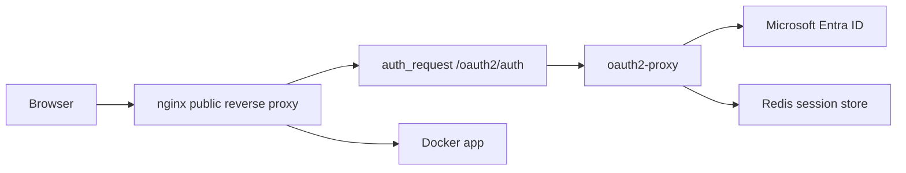
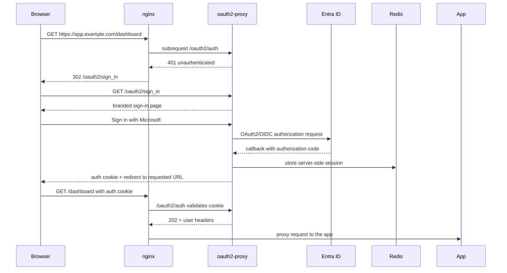

> [!key-insight] `oauth2-proxy` is an **authentication gate, not an authorization
> model**. It sits between public traffic and a private app, bounces the browser
> to an identity provider (Microsoft Entra ID here), and only lets requests
> through after a successful login. nginx's `auth_request` asks oauth2-proxy "is
> this browser allowed?" on every request — the app never sees an unauthenticated
> user. It's the cleanest way to bolt Microsoft sign-in onto a Docker app that has
> no native SSO. Generalized from field notes; all hostnames/IPs/paths are
> placeholders (`example.com`, `10.0.0.10`, `/home/<user>`).

## Core idea

`oauth2-proxy` does **not** usually log the user into the backend app. It
authenticates the *browser* before the backend is ever reached. nginx does the
proxying; oauth2-proxy only answers the auth subrequest and serves the sign-in /
callback endpoints.



For an app that still has its own local login, oauth2-proxy protects access to
that login page but does not automatically create an app session. To make the
user land directly in the app, one of these must be true:

1. The app supports native OIDC/SAML → configure it directly instead.
2. The app trusts reverse-proxy headers such as `X-Auth-Request-Email`.
3. The app's local auth can be **disabled** because oauth2-proxy is now the only
   public auth layer.

[[Uptime Kuma]] is the textbook case of option 3 — it has a setting to disable
local authentication when a third-party auth layer is in front of it.

> [!warning] oauth2-proxy is not a complete authorization model for every
> backend. If the app has its own roles, permissions, or per-user audit needs,
> decide whether disabling app auth is acceptable **before** doing it.

## When to use oauth2-proxy

**Use it when:**

- The app is browser-based and sits behind nginx.
- The app has no native Entra ID/OIDC support (or it's poor).
- You want one Microsoft sign-in page in front of several small internal tools.
- You can prevent direct access to the app port.
- App-level users can be generic/unauthenticated internally.

**Don't rely on it alone when:**

- The app exposes APIs that need per-user authorization *inside* the app.
- The app must know individual user identity for audit/compliance and can't
  consume trusted headers.
- Users can bypass nginx and reach the app port directly.
- The app has native OIDC that should be used instead.

## Components

| Component | Role |
|---|---|
| nginx | Public TLS termination, vhost routing, `auth_request` gate, proxy to the app |
| oauth2-proxy | OIDC client, sign-in page, cookie/session validation |
| Microsoft Entra ID | Identity provider + OAuth2/OIDC authorization server |
| Redis | Server-side session storage for oauth2-proxy |
| Docker network | Private network shared by oauth2-proxy + app containers |
| Backend app | The protected service (e.g. Uptime Kuma) |

Worked end-to-end flow:



## Entra ID app registration

Create an app registration in Microsoft Entra ID. You need four values:

- Tenant ID
- Client ID
- Client secret
- Redirect URI

Recommended redirect URI pattern (one SSO host can protect many subdomains if the
cookie/whitelist domains are set broadly enough, e.g. `.example.com`):

```text
https://status.example.com/oauth2/callback
```

> [!warning] Never commit Entra client secrets to a repo, changelog, wiki, or
> template. Keep them in `.env`, a secret manager, or a deployment vault.

See [[Microsoft 365 Administration]] for the Entra/app-registration side.

## Docker network pattern

Create a shared Docker network for nginx-facing apps:

```bash
docker network create nginx-net
```

Apps protected by oauth2-proxy join this network. If nginx runs on a **separate
VM** (the common split — public nginx host ≠ Docker host), nginx does not join the
Docker network; it reaches oauth2-proxy and the app over an internal SDN /
[[Tailscale]] / LAN IP.

Preferred exposure:

- Bind oauth2-proxy only to the internal host IP.
- Bind the backend app only to the internal host IP — or don't host-publish it at
  all if nginx can reach the container over the Docker network.
- Do **not** publish protected apps on `0.0.0.0` unless the host firewall blocks
  external access.

```yaml
# Good — bound to the internal host IP only
ports:
  - "10.0.0.10:3001:3001"
```

```yaml
# Avoid for protected apps — binds all interfaces; SSO bypass if firewall is incomplete
ports:
  - "3001:3001"
```

> [!warning] `-p 3001:3001` binds `0.0.0.0` and Docker's iptables rules can
> **bypass a host ufw/firewalld policy** (see [[Docker]] networking). Bind to the
> internal IP and let nginx be the only public entrance. Filter via the
> `DOCKER-USER` chain → [[nftables Firewall]].

## oauth2-proxy compose template

Use a dedicated folder:

```text
/home/<user>/oauth2-proxy/
  docker-compose.yml
  .env
  oauth2-proxy.cfg
  custom-templates/
    sign_in.html
  custom-assets/
    org-logo.png
  redis-data/
```

```yaml
services:
  oauth2-proxy:
    image: quay.io/oauth2-proxy/oauth2-proxy:v7.15.0
    container_name: oauth2-proxy
    restart: unless-stopped
    depends_on:
      - oauth2-redis
    env_file:
      - .env
    command:
      - --config=/etc/oauth2-proxy/oauth2-proxy.cfg
    ports:
      - "10.0.0.10:4180:4180"
    volumes:
      - ./oauth2-proxy.cfg:/etc/oauth2-proxy/oauth2-proxy.cfg:ro
      - ./custom-templates:/etc/oauth2-proxy/custom-templates:ro
      - ./custom-assets:/etc/oauth2-proxy/custom-assets:ro
    networks:
      - nginx-net

  oauth2-redis:
    image: redis:7-alpine
    container_name: oauth2-redis
    restart: unless-stopped
    command:
      - redis-server
      - --appendonly
      - "yes"
    volumes:
      - ./redis-data:/data
    networks:
      - nginx-net

networks:
  nginx-net:
    external: true
```

## Environment file

Keep secrets in `.env` (never in the `.cfg`, never in git):

```dotenv
OAUTH2_PROXY_CLIENT_ID=REDACTED
OAUTH2_PROXY_CLIENT_SECRET=REDACTED
OAUTH2_PROXY_COOKIE_SECRET=REDACTED
```

Cookie-secret requirements (a frequent footgun):

- Must be **16, 24, or 32 bytes**.
- A 32-character hex string works as 32 literal bytes.
- Don't assume a base64 string gets decoded unless the specific setting expects it.

```bash
openssl rand -hex 16     # a safe literal 32-char secret
chmod 600 .env           # lock it down
```

## oauth2-proxy config template

`oauth2-proxy.cfg` for Microsoft Entra ID:

```toml
http_address = "0.0.0.0:4180"
reverse_proxy = true

provider = "entra-id"
provider_display_name = "Microsoft"
oidc_issuer_url = "https://login.microsoftonline.com/<tenant-id>/v2.0"
redirect_url = "https://status.example.com/oauth2/callback"
scope = "openid email profile"
email_domains = [ "*" ]

upstreams = [ "static://202" ]
set_xauthrequest = true
pass_access_token = false
pass_authorization_header = false

session_store_type = "redis"
redis_connection_url = "redis://oauth2-redis:6379"

cookie_name = "_oauth2_proxy"
cookie_secure = true
cookie_httponly = true
cookie_samesite = "lax"
cookie_domains = [ ".example.com" ]
cookie_expire = "8h"
cookie_refresh = "1h"

skip_provider_button = false
whitelist_domains = [ ".example.com" ]

custom_templates_dir = "/etc/oauth2-proxy/custom-templates"
custom_sign_in_logo = "/etc/oauth2-proxy/custom-assets/org-logo.png"
footer = "-"
```

| Setting | Why it matters |
|---|---|
| `reverse_proxy = true` | oauth2-proxy is behind nginx; respect forwarded headers |
| `upstreams = ["static://202"]` | nginx uses it for **auth only**; it doesn't proxy the app |
| `set_xauthrequest = true` | emits `X-Auth-Request-*` headers for nginx/app |
| `session_store_type = "redis"` | stops oversized Entra sessions from breaking callbacks |
| `cookie_domains = [".example.com"]` | one auth cookie across subdomains |
| `skip_provider_button = false` | shows the branded page before the Microsoft hop |
| `custom_templates_dir` | enables the custom sign-in template |

## Why Redis session storage matters

Microsoft Entra ID tokens/claims can exceed the browser's **4 KB cookie limit**
when stored directly in oauth2-proxy cookies. Symptoms:

- `/oauth2/callback` returns `502 Bad Gateway` or an oauth2-proxy `500`.
- Logs show:

```text
Multiple cookies are required for this session as it exceeds the 4kb cookie limit.
Please use server side session storage (eg. Redis) instead.
```

Fix — server-side sessions:

```toml
session_store_type = "redis"
redis_connection_url = "redis://oauth2-redis:6379"
```

Then force-recreate (a plain restart may keep the old config/process depending on
what changed):

```bash
docker compose up -d --force-recreate oauth2-proxy
```

## nginx `auth_request` pattern

nginx protects the app with an internal subrequest to oauth2-proxy, redirects
unauthenticated users to the branded sign-in page, and proxies oauth2-proxy's own
public endpoints.

```nginx
# validate the session (internal subrequest only)
location = /oauth2/auth {
    internal;
    proxy_pass http://10.0.0.10:4180;
    proxy_pass_request_body off;
    proxy_set_header Content-Length "";
    proxy_set_header Host $host;
    proxy_set_header X-Real-IP $remote_addr;
    proxy_set_header X-Forwarded-For $proxy_add_x_forwarded_for;
    proxy_set_header X-Forwarded-Proto $scheme;
    proxy_set_header X-Auth-Request-Redirect $request_uri;
}

# unauthenticated → branded sign-in (NOT /oauth2/start, which skips the page)
location @oauth2_signin {
    return 302 /oauth2/sign_in?rd=$scheme://$host$request_uri;
}

# oauth2-proxy's public endpoints (sign_in, callback, static)
location /oauth2/ {
    proxy_pass http://10.0.0.10:4180;
    proxy_set_header Host $host;
    proxy_set_header X-Real-IP $remote_addr;
    proxy_set_header X-Forwarded-For $proxy_add_x_forwarded_for;
    proxy_set_header X-Forwarded-Proto $scheme;
    proxy_set_header X-Auth-Request-Redirect $request_uri;
}

# the protected app
location / {
    auth_request /oauth2/auth;
    error_page 401 = @oauth2_signin;

    auth_request_set $auth_user   $upstream_http_x_auth_request_user;
    auth_request_set $auth_email  $upstream_http_x_auth_request_email;
    auth_request_set $auth_cookie $upstream_http_set_cookie;
    add_header Set-Cookie $auth_cookie always;

    proxy_pass http://10.0.0.10:3001;
    proxy_http_version 1.1;
    proxy_set_header Upgrade $http_upgrade;
    proxy_set_header Connection "upgrade";
    proxy_set_header Host $host;
    proxy_set_header X-Real-IP $remote_addr;
    proxy_set_header X-Forwarded-For $proxy_add_x_forwarded_for;
    proxy_set_header X-Forwarded-Proto $scheme;
    proxy_set_header X-Auth-Request-User $auth_user;
    proxy_set_header X-Auth-Request-Email $auth_email;
}
```

> [!note] The `Upgrade`/`Connection "upgrade"` headers are required for websocket
> apps such as Uptime Kuma — omit them and the page loads but live updates break.
> See [[Nginx Reference]] for the general reverse-proxy + websocket pattern.

### Full vhost template

```nginx
server {
    listen 443 ssl;
    server_name app.example.com;

    ssl_certificate     /etc/nginx/certs/example.com/fullchain.pem;
    ssl_certificate_key /etc/nginx/certs/example.com/privkey.pem;

    ssl_protocols TLSv1.2 TLSv1.3;
    ssl_ciphers HIGH:!aNULL:!MD5;

    location = /favicon.ico {
        alias /etc/nginx/static/org/favicon.ico;
        access_log off;
        expires 7d;
    }

    location /oauth2/ {
        proxy_pass http://10.0.0.10:4180;
        proxy_set_header Host $host;
        proxy_set_header X-Real-IP $remote_addr;
        proxy_set_header X-Forwarded-For $proxy_add_x_forwarded_for;
        proxy_set_header X-Forwarded-Proto $scheme;
        proxy_set_header X-Auth-Request-Redirect $request_uri;
    }

    location = /oauth2/auth {
        internal;
        proxy_pass http://10.0.0.10:4180;
        proxy_pass_request_body off;
        proxy_set_header Content-Length "";
        proxy_set_header Host $host;
        proxy_set_header X-Real-IP $remote_addr;
        proxy_set_header X-Forwarded-For $proxy_add_x_forwarded_for;
        proxy_set_header X-Forwarded-Proto $scheme;
        proxy_set_header X-Auth-Request-Redirect $request_uri;
    }

    location @oauth2_signin {
        return 302 /oauth2/sign_in?rd=$scheme://$host$request_uri;
    }

    location / {
        auth_request /oauth2/auth;
        error_page 401 = @oauth2_signin;

        auth_request_set $auth_user   $upstream_http_x_auth_request_user;
        auth_request_set $auth_email  $upstream_http_x_auth_request_email;
        auth_request_set $auth_cookie $upstream_http_set_cookie;
        add_header Set-Cookie $auth_cookie always;

        proxy_pass http://10.0.0.10:3001;
        proxy_http_version 1.1;
        proxy_set_header Upgrade $http_upgrade;
        proxy_set_header Connection "upgrade";
        proxy_set_header Host $host;
        proxy_set_header X-Real-IP $remote_addr;
        proxy_set_header X-Forwarded-For $proxy_add_x_forwarded_for;
        proxy_set_header X-Forwarded-Proto $scheme;
        proxy_set_header X-Auth-Request-User $auth_user;
        proxy_set_header X-Auth-Request-Email $auth_email;
    }
}
```

Always validate before reload:

```bash
nginx -t && systemctl reload nginx
```

## Custom sign-in branding

oauth2-proxy supports `custom_templates_dir`, `custom_sign_in_logo`, `footer`, and
`provider_display_name`. A custom `sign_in.html` typically carries a background, a
logo, a title/subtitle, and a styled "Sign in with Microsoft" button.

```toml
custom_templates_dir = "/etc/oauth2-proxy/custom-templates"
custom_sign_in_logo  = "/etc/oauth2-proxy/custom-assets/org-logo.png"
provider_display_name = "Microsoft"
footer = "-"
```

> [!tip] oauth2-proxy embeds `custom_sign_in_logo` into the HTML. Use a
> web-resized logo, not a huge source image, to keep the login page light.

A branded SSO page usually also wants a favicon served by nginx:

```nginx
location = /favicon.ico {
    alias /etc/nginx/static/org/favicon.ico;
    access_log off;
    expires 7d;
}
```

```html
<link rel="icon" type="image/png" href="/favicon.ico">
```

Favicons cache hard — after a change, test with `curl -ksSI
https://app.example.com/favicon.ico` and hard-refresh the tab.

## App auth strategy

After oauth2-proxy works, decide what to do with the backend app's own login:

| App capability | Recommended approach |
|---|---|
| Native OIDC/SAML | Prefer native SSO inside the app |
| Trusted header auth | Configure the app to trust `X-Auth-Request-*` headers |
| No SSO, can disable auth | Disable local app auth, rely on oauth2-proxy |
| No SSO, cannot disable auth | Users will see two logins |

For [[Uptime Kuma]] specifically: oauth2-proxy does **not** auto-sign-in to Kuma;
Kuma has a built-in *Disable Authentication* option for exactly this case
(`Settings → Security → Disable Authentication`).

```yaml
services:
  uptime-kuma:
    image: louislam/uptime-kuma:2
    container_name: uptime-kuma
    restart: unless-stopped
    ports:
      - "10.0.0.10:3001:3001"      # internal IP only
    volumes:
      - ./data:/app/data
    networks:
      - nginx-net

networks:
  nginx-net:
    external: true
```

> [!danger] Never disable backend app auth while the app is reachable directly
> from the public internet. oauth2-proxy must be the **only** public entrance —
> confirm the app port is bound to an internal IP and firewalled first.

## Verification checklist

**Docker host:**

```bash
docker compose -f /home/<user>/oauth2-proxy/docker-compose.yml ps
curl -i http://10.0.0.10:4180/oauth2/auth                 # expect 401 unauthenticated
curl -sS "http://10.0.0.10:4180/oauth2/sign_in?rd=https://app.example.com/" \
  | grep -E "Sign in with Microsoft"                       # branded page renders
```

**nginx host** (reaches oauth2-proxy + app over the internal IP):

```bash
curl -i http://10.0.0.10:4180/oauth2/auth
curl -i http://10.0.0.10:3001
nginx -t && systemctl reload nginx
```

**Public HTTPS:**

```bash
curl -ksSI https://app.example.com/dashboard              # expect 302 → /oauth2/sign_in
curl -ksSI https://app.example.com/favicon.ico            # expect 200 image/x-icon
```

## Troubleshooting

**Browser lands on the app's own login after Microsoft** — oauth2-proxy worked but
the app still has local auth on. Configure SSO/trusted headers, or disable the
app's auth (only after blocking direct port access).

**`502 Bad Gateway` on `/oauth2/callback`** — oauth2-proxy down, nginx can't reach
it, or oversized cookies. Check:

```bash
docker logs --tail 100 oauth2-proxy
curl -i http://10.0.0.10:4180/oauth2/auth
nginx -t && tail -100 /var/log/nginx/error.log
```

If logs mention cookie size → switch to Redis sessions and `--force-recreate`.

**`403 CSRF token mismatch`** — stale cookies from a previous broken attempt, a
retried old callback URL, multiple tabs finishing stale flows, or a changed cookie
domain. Clear cookies for the parent domain, use a private window, and start from
the app URL (not an old `/oauth2/callback?...`).

**"authorization code already redeemed"** — OAuth codes are single-use; the
browser reloaded/retried an old callback. Start fresh from `/oauth2/sign_in`.

**Sign-in page skips straight to Microsoft** — `skip_provider_button = true`. Set
it `false` and route nginx to `/oauth2/sign_in?rd=...` (not `/oauth2/start?rd=...`).

**Custom template not showing:**

```bash
docker exec oauth2-proxy ls -la /etc/oauth2-proxy/custom-templates
```

Confirm `custom_templates_dir` in the `.cfg`, the `:ro` volume mount in compose,
then `docker compose up -d --force-recreate oauth2-proxy`.

**`permission denied` reading mounted config** — oauth2-proxy runs as a non-root
UID in the container; a locked-down home dir blocks path traversal:

```text
failed to load config file: open /etc/oauth2-proxy/oauth2-proxy.cfg: permission denied
```

Put the config under a traversable path, or grant a narrow ACL for the container
UID — without making secrets world-readable (`.env` stays `600`):

```bash
setfacl -m u:65532:x /home/<user>
chmod 644 /home/<user>/oauth2-proxy/oauth2-proxy.cfg
```

## Security notes

- Bind oauth2-proxy and backend apps to **internal IPs**, not all interfaces.
- Store the Entra client secret in `.env`/secret manager; never commit `.env`.
- Use **Redis sessions** for Entra ID to avoid cookie bloat.
- Use HTTPS externally and set `cookie_secure = true`.
- Use a parent cookie domain (`.example.com`) only when you *intend* shared auth
  across subdomains.
- Disabling backend app auth is safe **only** if direct app access is blocked.
- `email_domains = ["*"]` is broad — for production, prefer a tenant restriction or
  an Entra **group/assignment** restriction so only intended users can sign in.

## Operational runbook

1. Create/confirm the `nginx-net` Docker network.
2. Create the Entra app registration; add the callback URL
   (`https://status.example.com/oauth2/callback`).
3. Create `/home/<user>/oauth2-proxy/`.
4. Add `.env` (client ID, client secret, cookie secret).
5. Add `oauth2-proxy.cfg`.
6. Add `docker-compose.yml` (oauth2-proxy + Redis).
7. Add custom templates/assets if branding.
8. Start oauth2-proxy; verify `/oauth2/auth` → `401` and `/oauth2/sign_in` →
   branded HTML.
9. Add the nginx vhost (`/oauth2/`, `/oauth2/auth`, app `location /`).
10. `nginx -t` → reload.
11. Verify the public URL redirects to `/oauth2/sign_in`; complete a Microsoft
    login.
12. Decide the app's local-auth strategy (native SSO / trusted headers / disable).
13. Lock down direct app-port exposure; document the app, domain, and callback URL.

## Related

- [[Nginx Reference]] — the `auth_request` host, TLS, and reverse-proxy mechanics.
- [[Docker]] — compose, networks, internal-IP port binding, the `DOCKER-USER` chain.
- [[Uptime Kuma]] — the canonical protected app (disable-auth-behind-proxy case).
- [[Microsoft 365 Administration]] — the Entra ID / app-registration side.
- [[Self-Hosted Services]] — other services that sit behind this gate.
- [[Zero Trust Networking]] · [[Tailscale]] · [[nftables Firewall]] — keeping the
  app port off the public internet so the SSO gate is the only entrance.
